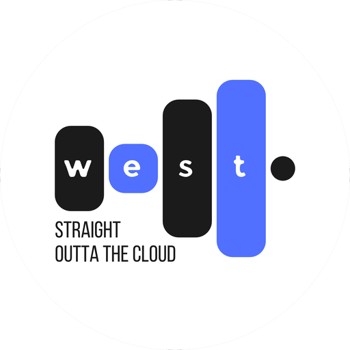
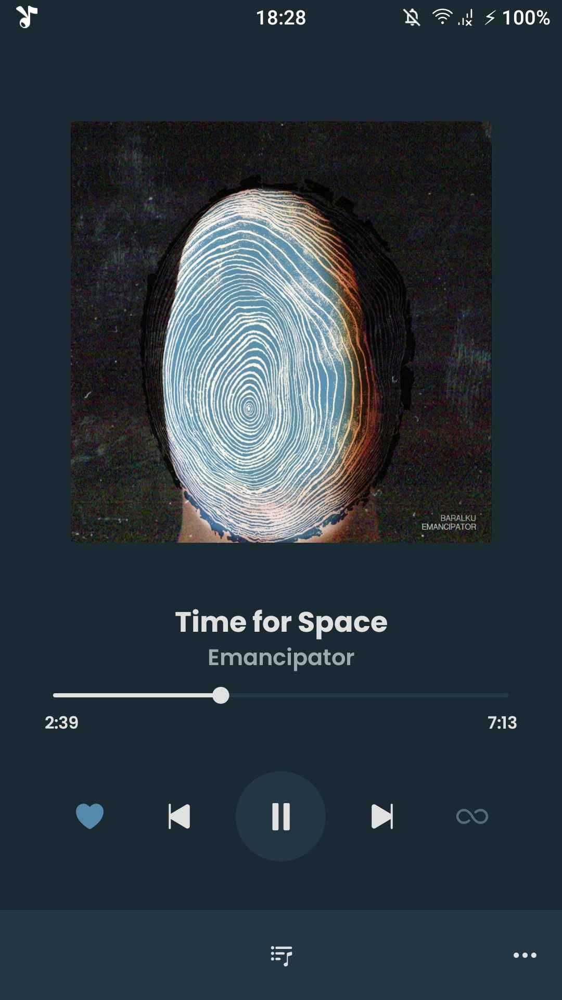
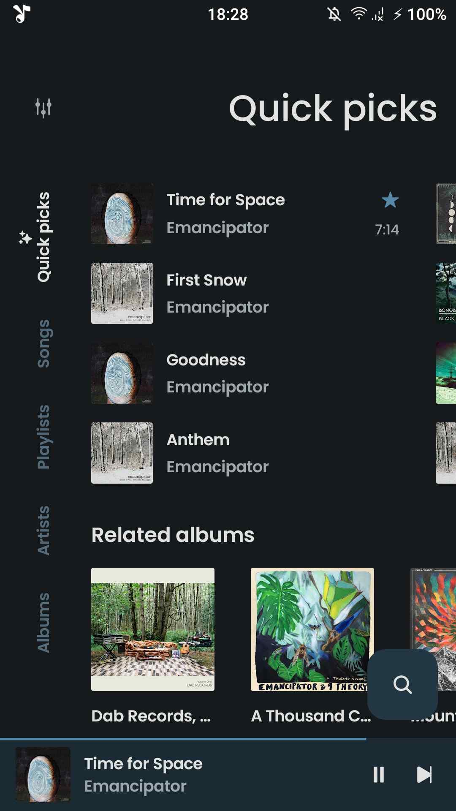
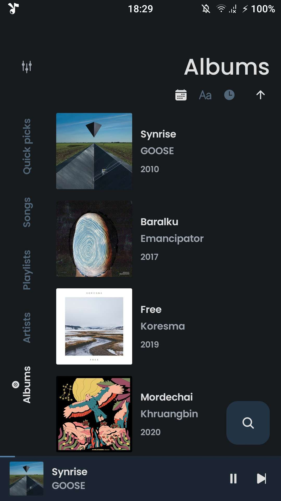

<div align="center">
    
    <h1>West</h1>
    <p>A beautiful, fast, and modern Android application for streaming music from YouTube Music</p>
</div>

---

<p align="center">
  
  
  
</p>

## ✨ Features

- 🎵 **Unlimited Streaming**: Stream songs and videos directly from YouTube Music.
- ⚡ **Lightning Fast & Lightweight**: Zero telemetry, minimal battery usage, and clean Material 3 design.
- 🎨 **Ultra HD Album Art**: Razor-sharp high-resolution cover artwork and fluid animations.
- 🌙 **Modern UI**: Light, Dark, and Dynamic Material You theming.
- 💾 **Smart Offline Caching**: Automatic caching of audio chunks for seamless offline playback.
- 🔍 **Full Exploration**: Search songs, albums, artists, videos, and playlists with instant suggestions.
- 🎤 **Synchronized Lyrics**: Fetch, view, and edit real-time synchronized and plain lyrics.
- 📻 **Custom Playlists & Queue**: Local playlists management, drag-and-drop queue reordering, and persistent state.
- 🚗 **Android Auto & Background Play**: Reliable background audio service with lockscreen controls.
- ⏱️ **Audio Tools**: Audio normalization (replay gain), sleep timer, and silence skipping.

---

## 🛠️ Building From Source

### Prerequisites
- **JDK 17** (Ensure `JAVA_HOME` points to Java 17)
- **Android SDK** (API 34, Build Tools 34.0.0)

### Clone & Build
```bash
git clone https://github.com/<your-username>/West.git
cd West

# Build Debug APK
./gradlew assembleDebug

# Build Release APK
./gradlew assembleRelease
```
The compiled APK will be located in `app/build/outputs/apk/`.

---

## 🤝 Contributing

Contributions are always welcome! Feel free to:
1. Fork the repository
2. Create your feature branch (`git checkout -b feature/amazing-feature`)
3. Commit your changes (`git commit -m 'Add amazing feature'`)
4. Push to the branch (`git push origin feature/amazing-feature`)
5. Open a Pull Request

---

## 📜 Disclaimer

This project is an independent open-source music player and is not affiliated with, funded, authorized, endorsed by, or in any way associated with Google LLC, YouTube, or any of their subsidiaries.

---

## 📄 License
This project is licensed under the GPL-3.0 License - see the [LICENSE](LICENSE) file for details.
